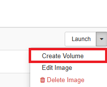

..    include:: <isonum.txt>

Step-by-Step Guide: Deploying a Windows VM
==========================================
   
Select the Windows Image
------------------------
.. _Windowsimages:

From the list of Public Images, look for the image named "Win10_22HXXXX" (or similar).
   
.. _publicimages:

.. image:: ./images/Win10-ImageWin10.png
   :align: center

From the dropdown menu next to the image, select "Create Volume".

Create the Volume
-----------------

While creating the volume, fill in all required parameters.
Important: make sure to set the volume size to at least 35GB.
(The system might allow smaller sizes, but Windows installation or updates may fail without enough space.)

Launch an Instance from the Volume
----------------------------------

Once the volume has been created, it will appear under the Volumes section.
Open the Actions dropdown next to the new volume and select "Launch as Instance".
Configure the instance as needed (e.g., flavor, network, key pair).

Enable Remote Access via RDP - Setting Security groups(s)
---------------------------------------------------------
.. _Setting Security group:

To allow remote access to the Windows VM via RDP, you must configure a Security Group that includes a rule to allow inbound traffic on port 3389 (TCP).
This rule is already active in the image provided, but you must still assign the appropriate security group to the instance.

.. image:: ./images/Win10-CreateSecurityGroupRDP.png
   :align: center

.. NOTE ::
   Note: If additional ports need to be opened, remember that you must:
   * Add the corresponding rule to the security group in OpenStack
   * Allow the same port through the Windows firewall inside the VM

Initial Windows Setup via Console
---------------------------------

Once the instance has been successfully created, you will have access to a running Windows VM.
Navigate to the Console tab (alongside Overview, Interfaces, Log, Console, Action Log) to interact with the VM.

.. image:: ./images/Win10-Console.png
   :align: center

Install and Configure Windows 10
--------------------------------
From the console, you can begin the initial Windows 10 setup process. Follow the on-screen instructions:

* Select the appropriate region

  .. image:: ./images/Win10-StartInstallation.png
     :align: center

* Choose your keyboard layout

  .. image:: ./images/Win10-Keyboard.png
     :align: center

* Wait for any necessary operations to complete (this might take a few minutes)

  .. image:: ./images/Win10-Wait.png
     :align: center

License Agreement
-----------------

Accept the Windows License Agreement when prompted.

Installation Mode
-----------------
Choose the installation type that suits your needs. In most cases, you’ll continue with a standard installation.

Set Up a User Account
---------------------
   
When prompted to add your account:

* Select “Offline account” (unless you have a Microsoft account and prefer to use that)

  .. image:: ./images/Win10-AccountOffline.png
     :align: center

* If you select offline mode, continue by clicking “Limited experience” when asked

   .. image:: ./images/Win10-Go.png
      :align: center

Create a Local User Account
---------------------------
Set a username and password for the local user account. 
This will be the main credential used to log in to the VM.

.. image:: ./images/Win10-Account.png
   :align: center

Set Security Questions
----------------------

During the setup process, you’ll be asked to create three security questions. These are required for account recovery in case you forget your password.
Choose questions and answers that are easy for you to remember but hard for others to guess.

.. image:: ./images/Win10-Questions.png
   :align: center

Privacy and Permissions Settings
--------------------------------

You will be prompted to configure various Windows permissions and privacy settings. Review and choose according to your preferences:

* Allow Microsoft to use your location

  .. image:: ./images/Win10-Position.png
     :align: center
* Enable Find My Device

  .. image:: ./images/Win10-Dispositivo.png
     :align: center
* Choose to send diagnostic data to Microsoft (basic or full)

  .. image:: ./images/Win10-Diagnostic.png
     :align: center
* Enable pen input improvement

  .. image:: ./images/Win10-Pen.png
     :align: center
* Allow personalized experiences using diagnostic data

  .. image:: ./images/Win10-Expertice.png
     :align: center
* Permit apps to use your advertising ID

  .. image:: ./images/Win10-ID.png
     :align: center
* Customize your experience (optional settings based on usage)

  .. image:: ./images/Win10-Personal.png
     :align: center
* Enable or disable Cortana (Microsoft's virtual assistant)

  .. image:: ./images/Win10-Cortana.png
     :align: center
* Allow automatic setup and updates (do not turn off the computer during this process)

  .. image:: ./images/Win10-execution.png
     :align: center

Finalizing Setup
----------------

After completing these steps, Windows will finalize the setup.
You’ll see a message like “Almost there…”.

.. image:: ./images/Win10-Ready.png
   :align: center

Once finished, the system will boot into a fully operational Windows 10 environment, based on the original "Win10_22HXXXX" image.

Windows Activation
-------------------

You may notice a watermark in the lower-right corner of the desktop saying:
"Activate Windows. Go to Settings to activate Windows."

Open Settings > Update & Security > Activation.

A message will appear: "Windows is not activated. Activate now."

.. image:: ./images/Win10-AccountWin.png
   :align: center

Proceed to enter a valid product key when prompted.

.. NOTE ::

  For official instructions on how to activate Windows, refer to the Microsoft support page:
  https://support.microsoft.com/en-us/windows/activate-windows-10-92c27cff-d2c2-6d78-4136-6b40baecc8c3
  If you don’t have a valid product key, you will need to acquire one through Microsoft or a licensed distributor.

