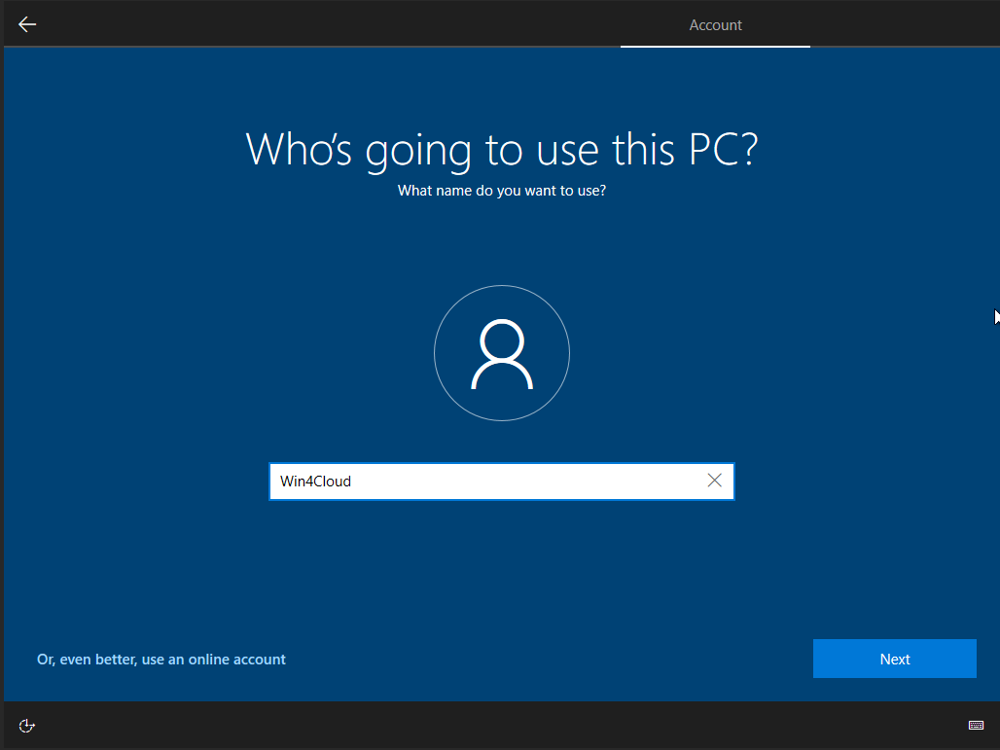

..    include:: <isonum.txt>

Deploying and using Windows VMs
==========================================

Deploying a Windows VM: step-by-step guide
------------------------------------------

Select the Windows Image
^^^^^^^^^^^^^^^^^^^^^^^^
.. _Windowsimages:

From the list of Public Images, look for the image named "Win10_22HXXXX" (or similar).
   
.. _publicimages:

From the dropdown menu next to the image, select "Create Volume".

.. image:: ./images/Win10-CreateVolumefromImage.png
   :align: center

Create the bootable volume
^^^^^^^^^^^^^^^^^^^^^^^^^^

While creating the volume, fill in all the required parameters.
Important: make sure to set the volume size to **at least 35GB**.
(The system might allow smaller sizes, but Windows installation or updates may fail without enough space.)

You should also assign **a clear and meaningful name** to the volume (e.g., including your username or project name), so it can be easily identified later.

.. image:: ./images/Win10-CreateVolume.png
   :align: center

Launch an instance from the bootable volume
^^^^^^^^^^^^^^^^^^^^^^^^^^^^^^^^^^^^^^^^^^^

Once the volume has been created, it will appear under the Volumes section.
Open the Actions dropdown next to the new volume and select "Launch as Instance".
Configure the instance as needed (specifying the flavor, network,  etc.).

.. image:: ./images/Win10-LaunchInstance.png
   :align: center

Enable Remote Access via RDP - Setting Security groups(s)
^^^^^^^^^^^^^^^^^^^^^^^^^^^^^^^^^^^^^^^^^^^^^^^^^^^^^^^^^
.. _Setting Security group:

To allow remote access to the Windows VM via RDP, you must configure a Security Group that includes a rule to allow inbound traffic on port 3389 (TCP).
This rule is already active in the image provided, but you must still assign the appropriate security group to the instance.

.. image:: ./images/Win10-AddRuleRDP.png
   :align: center

.. NOTE ::
   Note: If additional ports need to be opened, remember that you must add the corresponding rules to the security
   group in OpenStack and allow the same ports through the Windows firewall inside the VM

Initial Windows Setup via Console
^^^^^^^^^^^^^^^^^^^^^^^^^^^^^^^^^

Once the instance has been successfully created, you will have access to a running Windows VM.
Navigate to the Console tab (alongside Overview, Interfaces, Log, Console, Action Log) to interact with the VM.

.. WARNING::
   When a VM is deleted, the associated volume cannot be reused to launch a new instance.
   This is because the volume becomes tightly bound to the deleted VM’s configuration and is no longer bootable or attachable to a new VM.
   Therefore, it is strongly recommended to delete the volume manually after deleting the VM, to free up resources and avoid unnecessary storage consumption.

Install and Configure Windows 10
^^^^^^^^^^^^^^^^^^^^^^^^^^^^^^^^

From the console, you can begin the initial Windows 10 setup process. 

**Please wait approximately 15 minutes before starting the Windows configuration process after the VM has been created.**

Follow the on-screen instructions:

* Select the appropriate region

  .. image:: ./images/Win10-StartInstallationENG.png
     :align: center

* Choose your keyboard layout

  .. image:: ./images/Win10-KeyboardENG.png
     :align: center

* Wait for any necessary operations to complete (this might take a few minutes)

  .. image:: ./images/Win10-WaitENG.png
     :align: center

License Agreement
^^^^^^^^^^^^^^^^^

Accept the Windows License Agreement when prompted.

Installation Mode
^^^^^^^^^^^^^^^^^
Choose the installation type that suits your needs. 
An installation for personal use should be suitable for most cases.

Set Up a User Account
^^^^^^^^^^^^^^^^^^^^^
   
When prompted add your account:

* Select “Offline account” (unless you have a Microsoft account and you prefer to use that)

  .. image:: ./images/Win10-AccountOfflineENG.png
     :align: center

* If you select offline mode, continue by clicking “Limited experience” when asked

   .. image:: ./images/Win10-GoENG.png
      :align: center

Create a Local User Account
^^^^^^^^^^^^^^^^^^^^^^^^^^^
Set a username and password for the local user account. 
This will be the main credential used to log in to the VM.

 

Set Security Questions
^^^^^^^^^^^^^^^^^^^^^^

During the setup process, you’ll be asked to define three security questions. These are required for account recovery in case you forget your password.
Choose the questions and answers that are easy for you to remember but hard for others to guess.

Privacy and Permissions Settings
^^^^^^^^^^^^^^^^^^^^^^^^^^^^^^^^

You will be prompted to configure various Windows permissions and privacy settings. Review and choose according to your preferences:

* Customize your experience (optional settings based on usage)

  .. image:: ./images/Win10-PersonalENG.png
     :align: center
* Enable or disable Cortana (Microsoft's virtual assistant)

  .. image:: ./images/Win10-CortanaENG.png
     :align: center
* Allow automatic setup and updates (do not turn off the computer during this process)

  .. image:: ./images/Win10-executionENG.png
     :align: center
  
  .. image:: ./images/Win10-execution2ENG.png
     :align: center

Finalizing the Setup
^^^^^^^^^^^^^^^^^^^^

After completing these steps, Windows will finalize the setup.
You’ll see a message like “Almost there…”.

Once finished, the system will boot into a fully operational Windows 10 environment, based on the original "Win10_22HXXXX" image.

Windows Activation
^^^^^^^^^^^^^^^^^^

You may notice a watermark in the lower-right corner of the desktop saying:
"Activate Windows. Go to Settings to activate Windows."

Open Settings > Update & Security > Activation.

A message will appear: "Windows is not activated. Activate now."

Proceed to enter a valid product key when prompted.

.. NOTE ::

  For official instructions on how to activate Windows, refer to the Microsoft support page:
  https://support.microsoft.com/en-us/windows/activate-windows-c39005d4-95ee-b91e-b399-2820fda32227#windowsversion=windows_10

  If you don’t have a valid product key, you will need to acquire one through Microsoft or a licensed distributor.

Using an Existing Windows License from a Physical Machine
---------------------------------------------------------

If you have a physical PC with a Windows license sticker (typically found on the case or under the battery for laptops), 
you can use the **product key printed on the label** to activate your virtual machine.
Enter the key during the Windows activation process.

In some cases, the product key may be embedded in the BIOS/UEFI firmware instead of printed on a label. To retrieve it, follow these steps:

* Open Command Prompt as Administrator inside the physical PC with a Windows license

* Run the following command:

  ::

     wmic path softwarelicensingservice get OA3xOriginalProductKey

If the key is detected, it will be displayed and can be used for activation.

KMS License Activation (**INFN Staff Only**)
^^^^^^^^^^^^^^^^^^^^^^^^^^^^^^^^^^^^^^^^^^^^

.. NOTE ::
   
   **Only INFN staff users** are authorized to request a KMS (Key Management Service) license.
   It is the user's responsibility to carefully read and understand the terms and conditions related to activating a KMS license on virtualized clients.
   Failure to comply with the licensing terms may result in improper activation or violation of usage policies.

* Usage Terms and Conditions:

   https://web.infn.it/windows/index.php/licenze/windows-client-licenze-e-virtualizzazione

* KMS Installation Instructions:
      
   https://web.infn.it/windows/index.php/istruzioni/17-kms-categoria

* KMS client setup keys for Windows operating systems at the following official Microsoft link:

  https://learn.microsoft.com/it-it/windows-server/get-started/kms-client-activation-keys?tabs=server2025%2Cwindows1110ltsc%2Cversion1803%2Cwindows81#windows-11-and-windows-10-semi-annual-channel

  These keys are used for KMS-based activation and should be entered using the slmgr.vbs /ipk command as described in the activation section.

  .. NOTE ::

   These keys do not activate Windows by themselves — they require access to a valid KMS server (e.g., kms.infn.it).

.. WARNING::

      To activate Windows using the KMS server, follow these steps only if you are authorized and have a valid product key.
      If you need support or to request a key, please contact: support@cloudveneto.it

* Open Command Prompt as Administrator (Right-click on Command Prompt and select “Run as Administrator”)

* Run the following commands one by one:

   ::

      cscript \windows\system32\slmgr.vbs /ipk "ENTER-OS-PRODUCT-KEY-HERE"   #Replace "ENTER-OS-PRODUCT-KEY-HERE" with the specific product key for your Windows version.
      cscript \windows\system32\slmgr.vbs /skms kms.infn.it
      cscript \windows\system32\slmgr.vbs /ato

These commands will:

* Set the product key

* Configure the KMS server to kms.infn.it

* Attempt to activate Windows via the INFN KMS infrastructure

Connecting to the Windows VM via Remote Desktop from Windows
------------------------------------------------------------

Once the setup is complete and the instance is running, you can connect to the virtual machine using Remote Desktop (RDP).

* Open the Remote Desktop Connection application on your local machine. In the Computer field, enter the IP address assigned to the VM and the username
  
  .. image:: ./images/Win10-RemoteDesktop.png
   :align: center

* Use the username and password of the local account you created during the Windows setup

  .. image:: ./images/Win10-RemoteDesktopLogin.png
   :align: center

* Once connected, you will be able to interact with your Windows VM just like a physical machine.

  .. image:: ./images/Win10-VMConnect.png
   :align: center

Connecting to the Windows VM via Remote Desktop from Linux
----------------------------------------------------------

Once the setup is complete and the instance is running, you can connect to the virtual machine using e.g. rdesktop (lightweight, terminal-based).

* Installation
  
    On RHEL9 compatible systems (e.g. AlmaLinux9) open a terminal and, as root, run

    ::

       dnf install rdesktop 

* Usage

    To connect to the Windows VM, use:

    ::

      rdesktop X.X.X.X

    Replace X.X.X.X with the IP address of the Windows VM you want to access.

   .. image:: ./images/Win10-RemoteDesktopLinux.png
    :align: center

Accessing a Windows VM from a network without direct access (SSH tunnel for RDP)
--------------------------------------------------------------------------------

If your machine is on a network that cannot directly access the Windows VM, you need to create an SSH tunnel for port 3389 (used by Remote Desktop Protocol - RDP).

You will connect through a jump host (a machine that can access the VM is gate.cloudveneto.it ).

* From Linux

  * Create the SSH tunnel:

    :: 

       ssh -L20389:10.X.Y.Z:3389 <user>@gate.cloudveneto.it

  
    10.X.Y.Z is VM IP and  20389 can be replaced with number in the range 1025-65535  
    Leave this terminal open and the tunnel will be active as long as the SSH session is alive.

  *  Start RDP client (using rdesktop):

    :: 

      rdesktop localhost:3389

* From Windows (using PowerShell or Command Prompt)

  * Open PowerShell or Command Prompt as Administrator

    Right-click → "Run as administrator")

  * Create the SSH tunnel

    Run the following command (replace the placeholders with your information):

    ::
       ssh -L 13389:<VM-PRIVATE-IP>:3389 <your_username>@gate.cloudveneto.it

    Leave the terminal window open and the tunnel will be active as long as the SSH session is alive.

  * Start RDP connection via Remote Desktop 

